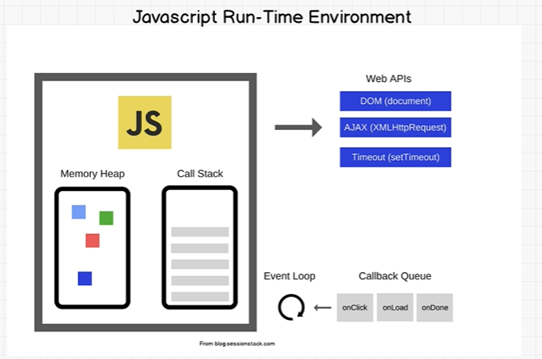

## How Does JavaScript Works?

* A program:
  * allocate memory.
  * parse and execute.
  

* ### JavaScript Engine consists of two parts:
  * Memory Heap: `It is used to allocate the memory used by your JavaScript program.`
  * Call Stack: `Within the call stack, your JS code is read and gets executed line by line.`

* ### JavaScript is a single threaded language (which means it has only one call stack that is used to execute the program) ans synchronous, but can be non-blocking (can be asynchronous using callback functions.).

     

