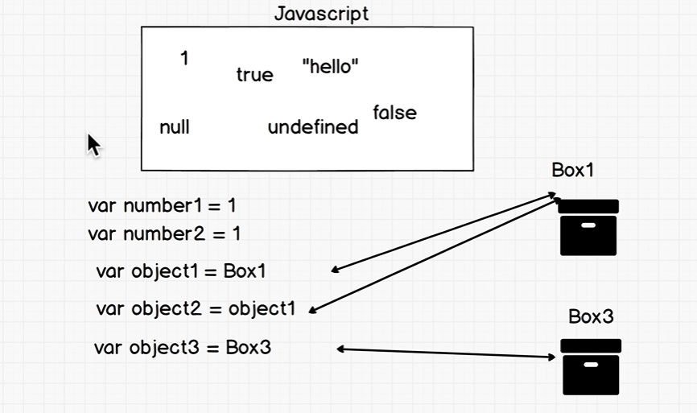

* ### A function inside an object is method.
* ### We can't set property for a null defined variable. (var nullObj = null).
* ### With while loop we check the condition first and then do the stuff, with do while loop we do the stuff first and then check the condition.
* ### We can't access index directly using forEach. We can do that by: 
   `funcName.forEach(funcVar, i){`

     `console.log(i);`

     `};`

* ### Window is the parent object of document, alert, prompt.  etc.

* ### A closure is a function having access to the parent scope, even after the parent function has closed. `A function ran, the function executed. It's never going to execute again, but it's going to remember that there are references to those variables so the child scope always has access to aprent scope.`

* ### Currying is the process of converting a function that takes multiple arguments at a time into a function that takes one at a time.

* ### Compose is act of putting two functions together to form a third function with the output of one function as the input of the other.

* ### Two elements of a pure function:
      1. Deterministic --> always produces the same results given the same inputs.
      2. No Side Effects -->  It does not depend on any state, or data, change during a program’s execution. It must only depend on its input elements.

* ### map, filter, reduce in array.

* ### <a href="https://sdras.github.io/array-explorer/">Explore array methods</a>
* ### <a href="https://sdras.github.io/object-explorer/">Explore object methods</a>

* ### Reference type: `(reason why [] === [] gives false.)`
     

* ### <a href="https://towardsdatascience.com/javascript-context-this-keyword-9a78a19d5786">Context</a>

* ### <a href="https://medium.com/@taylorshephard1/instantiation-patterns-in-javascript-7f9463b95839#:~:text=An%20instantiation%20pattern%20in%20JavaScript,Prototypical%2C%20Pseudoclassical%2C%20and%20ES6.">Instantiation</a>

* ### Pass by value and Pass by reference
   * Objects in JavaScript are stored in memory and passed by reference.
       * Arrays are simply objects. (passed by ref.).
   * Primitive type are passed by value. (Just make a copy).
   
* ### Type Coercion:
   * Type coercion is the process of converting value from one type to another (such as string to number, object to boolean, and so on).
   * In JavaScript, type coercion happens when we use `==`.
   * <a href="https://dorey.github.io/JavaScript-Equality-Table/">Type Coercion Table</a>
   * <a href="https://developer.mozilla.org/en-US/docs/Web/JavaScript/Equality_comparisons_and_sameness">MDN - Equality Comparisons</a>
   
   
